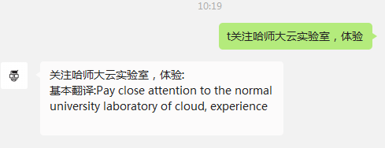
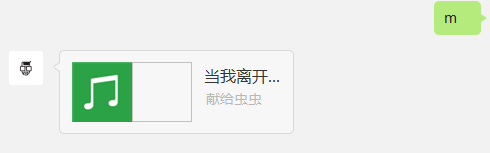
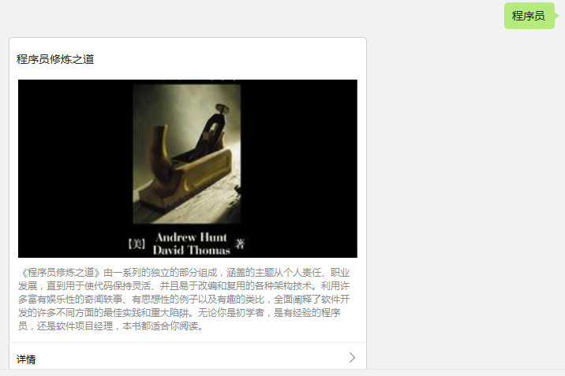

## wechat 

### 基于python的微信公众平台应用开发

#### 技术
    代码托管在SAE上，python+MySQL 

#### 功能效果：

* 输入t+中文或者英文返回对应的英中翻译
* 输入【m】随机来首音乐听，建议在wifi下听
* 输入【ly+你的留言内容】,来给我留言
* 【查阅书籍信息】输入书籍名，便可查看相关书籍信息

【翻译】
 
 
 
【音乐欣赏】
  
 

【留言】
 
    
 
【书籍信息】

   

#### 说明
  初次使用python开发wechat,大神勿喷，欢迎提建议，补充。希望对开发wechat应用的朋友有所帮助！

